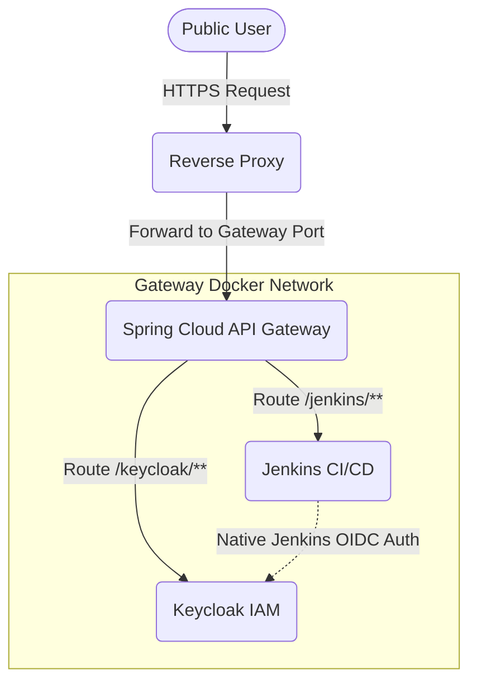

# api-gateway

Spring Cloud Gateway service that forwards requests to internal services
based on route rules defined in a file on the server.

## Request Flow Architecture



## Security Chain Flow


## Build

```bash
./mvnw clean package -DskipTests
```

On Windows PowerShell:

```powershell
.\mvnw.cmd clean package -DskipTests
```

## Configure Routing Rules

Gateway rules are loaded from `/config/routes.yaml` inside the container.
Mount a file from your server to this path.

Example route rules file:

```yaml
spring:
  cloud:
    gateway:
      routes:
        - id: users-service
          uri: http://users-service:8081
          predicates:
            - Path=/users/**
          filters:
            - StripPrefix=1
```

## Docker

From the `docker` directory:

```bash
docker compose up --build -d
```

This will:
- Build the image from the root project context.
- Expose gateway on port `8080`.
- Mount `docker/routes.yaml` to `/config/routes.yaml` in the container.
