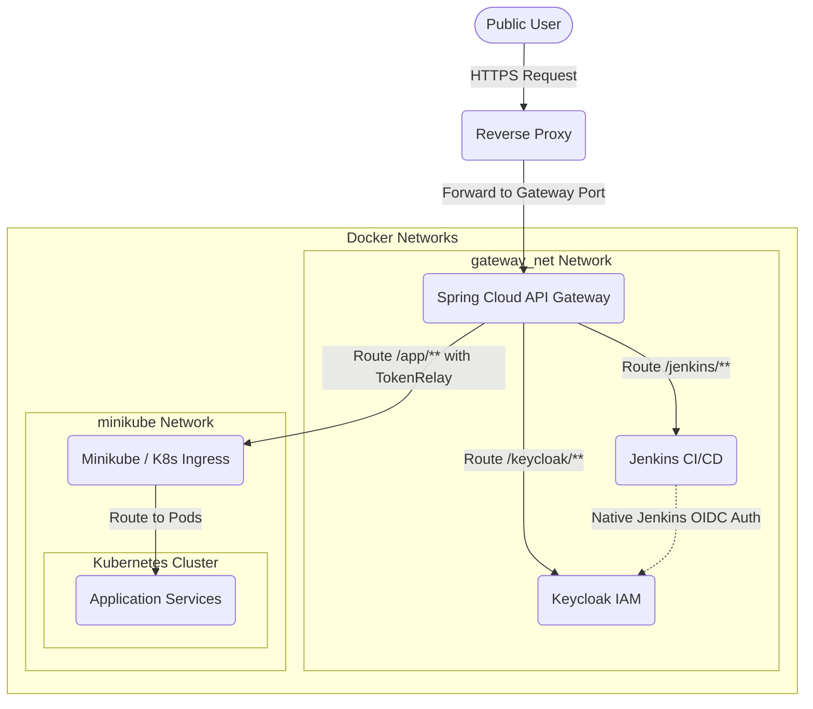
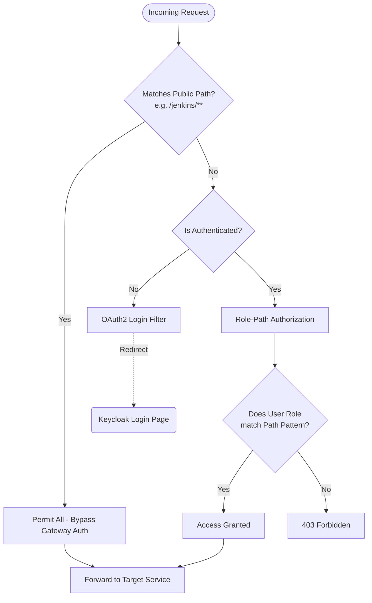

# api-gateway

Spring Cloud Gateway service that forwards requests to internal services based on routing and security configurations loaded at runtime.

## Request Flow Architecture



## Security Chain Flow



## Build

To compile and package the application:

```bash
./mvnw clean package -DskipTests
```

On Windows PowerShell:

```powershell
.\mvnw.cmd clean package -DskipTests
```

## Configuration Management (Strict Zero-Copy Model)

To prevent routing rules and security credentials from being baked into the Docker image or processed within CI/CD pipelines, the gateway enforces a **Strict Zero-Copy Configuration Model**:

1. **Mandatory Runtime Configurations**:
   - The configurations `routes.yaml` and `security.yaml` are loaded dynamically at runtime and are mandatory for the application context to start.
   - Configured in [application.yaml](app/common/src/main/resources/application.yaml) under `spring.config.import`:
     ```yaml
     spring:
       config:
         import:
           - file:/config/routes.yaml
           - file:/config/security.yaml
     ```
     *If these files are missing, the Spring boot process fails immediately with a fatal exception.*

2. **Secure External Volume (`apigw_config`)**:
   - Configurations are stored in a restricted host folder (e.g., `/opt/apigw/config`) readable only by authorized processes and writable only by `root` (sudoers).
   - This directory is exposed to the gateway container via an external, read-only named Docker volume:
     ```yaml
     volumes:
       - apigw_config:/config:ro
     ```

3. **Dynamic Logback Reloading**:
   - The logging configuration (`logback.xml`) is set to automatically scan and apply logging level adjustments dynamically every 10 minutes without requiring a service restart.

## Minikube / Kubernetes Network Integration

For forwarding traffic to workloads inside a Kubernetes cluster, the Gateway integrates directly with Minikube:

- **Dual Network Interfaces**: The API Gateway container connects to the standard `gateway_net` Docker network as well as the `minikube` Docker network.
- **Minikube DNS Resolver**: An `extra_hosts` mapping maps the `minikube` domain to the host VM where the Minikube cluster runs:
  ```yaml
  extra_hosts:
    - "minikube:${K8S_APPLICATION_SERVER_HOST}"
  ```
- **TokenRelay Security Propagation**: The routes configured for the Minikube endpoints (`/app/**`) employ the `TokenRelay` filter, forwarding OAuth2 access tokens as Bearer tokens in the `Authorization` header downstream.

## Docker Deployment

Deploy the gateway services from the `docker/apigw` directory:

```bash
docker compose up -d
```

> **Note**: Both the `gateway_net` / `minikube` external networks and the `apigw_config` volume must be pre-provisioned on the host.

## Volumes

The following Docker volumes are used across the service containers:

**Named Volumes:**
- `apigw_config` (apigw-compose): Read-only external volume containing `routes.yaml`, `security.yaml`, and `logback.xml`.
- `postgres_data` (postgres-compose): Persistent storage for PostgreSQL database.
- `jenkins_home` (jenkins-compose): Persistent storage for Jenkins CI/CD data and configuration.

**Host Bind Mounts:**
- `/var/run/docker.sock:/var/run/docker.sock` (jenkins-compose): Allows Jenkins to run Docker commands on the host.

